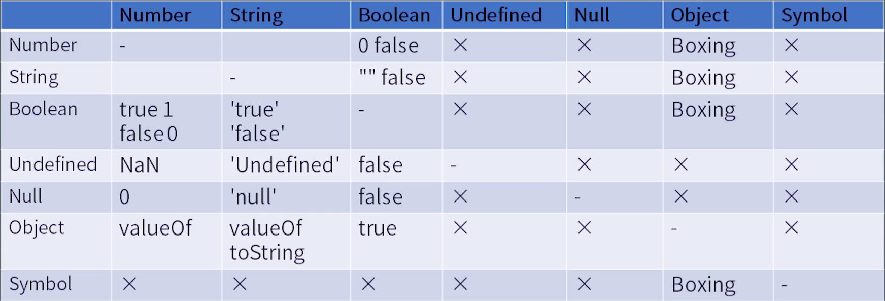
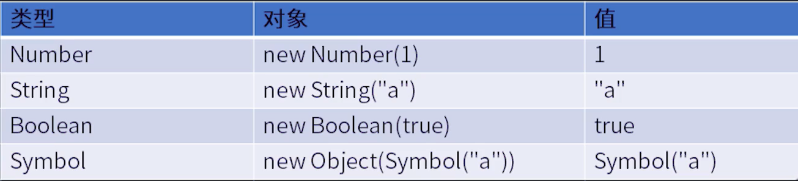

# 学习笔记

# 1. 运算符和表达式
## 1.1 语法树和运算符优先级概述
## 1.2 Expression 优先集

`Member`优先级最高。优先级只是一种定义，具体还是要看表达式具体使用。

1. Member
  - a.b \ a['b']
  - foo`string`
  - super.b \ super['b']
  - new.target
  - new Foo()
2. New
  - new Foo
3. Reference
4. Call 函数调用
  - foo()
  - super()
  - foo().b \ foo()['b']
  - foo()`b`
5. Left Handside & Right Handside
6. Update 自增自减
7. Unary 单目运算符
  - delete
  - void foo()
  - typeof a
  - +a \ -a \ ~a \ !a
  - await a
8. Exponental ** 右结合乘方
9. 计算符号
  - Multiplcative `*` `/` `%`，自转为`Number`
  - Addtive `+` `-`，字符串、数字的相加
  - Shift `>>` `<<`  `>>>`
  - Relationship `<` `>` `<=` `>=` `instanceof` `in`
10. 相等
  - == / !=
  - === / !==
11. Bitwise 位运算
  - & 按位与 
  - ^ 异或
  - | 按位或
12. Logical 逻辑运算符
 - &&
 - ||
13. Conditional
 - ? : 三元

# 2. 类型转换

## Unboxing 拆箱

将对象装成普通类型的过程。

1. ToPremitive
2. toString \ valueOf
  - 加法运算表达式优先调用`valueOf`
  - 如果对象作为属性名，优先调用`toString`
3. Symbol.toPremitive
  任何情况下都是最优先

## Boxing 装箱

装箱返回的是一个包装对象。

# 3. 语句 | 运行时相关概念

- 简单语句
- 组合语句
- 声明（标准中是分开的）

运行时会产生`Completion Record`和`Lexical Environment`

## 3.1 Completion Record

语句完成状态的记录。JS无法访问。

- `[[type]]`: normal break continue return throw
- `[[value]]`: 基本类型，值
- `[[target]]`: label

## 3.2 Lexical Environment

词法环境。es6中`let` `const`定义的变量将存在词法环境中。

# 4. 语句 | 简单语句和复合语句

# 4.1 简单语句

已不可容纳其他语句的语句。

- ExpressionStatement 表达式
- EmptyStatement 空
- DebbugerStatement 断点
- ThrowStatement 抛错
- ContinueStatement 结束当次循环
- BreakStatement 跳出循环
- ReturnStatement 结束返回

## 4.2 复合语句

- BlockStatement
- IfStatement
- SwitchStatement
- IterationStatement 循环
- WithStatement with，高风险，内部作用域可能进入全局
- LabelledStatement 标记，
- TryStatement

# 5. 声明 Declaration

- Function
- Generator
- AsyncFuntion
- AsyncGenerator
- VariableStatement `var` 变量提升，但赋值不提升
- Class 存在暂时性死区
- Lexical `let` `const` 存在暂时性死区

# 6. 结构化 | 宏任务与微任务

消息队列（事件循环）机制。

# 7. 结构化 | 函数调用

函数调用形成调用栈，栈环境表示执行上下文栈。

一个执行栈可能包含一下信息：

- code evaluate state 针对生成器的上下文保存状态信息。
- Function
- Script or Module
- Generator 生成器协程
- Realm 内置对象
- Lexical Environment 词法环境
- Variable Environment 变量环境，仅作var变量

## 7.1 闭包与作用域链

## 7.2 Realm

一个JS引擎实例中，所有的内置对象都会放入`Realm`。
不同的`Realm`，原型是不一样的。

作业：G6可视化所有JS内置对象，不包括浏览器的。
